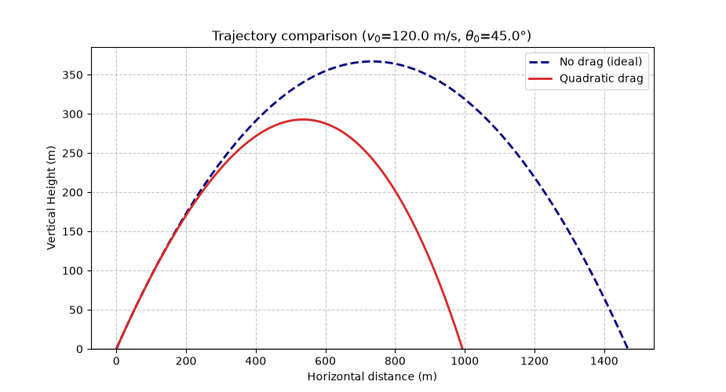
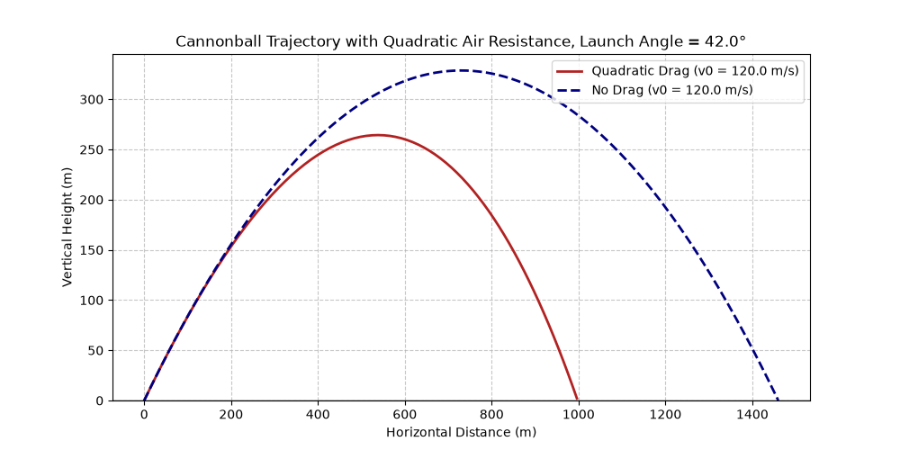

# Cannonball Trajectory: Quadratic Drag vs. Ideal Case

Numerical comparison of drag-free and drag-affected projectile motion, 
solved with RK4/RK45 integration.

[Full writeup](paper.md)



## Quick start
```bash
pip install -r requirements.txt
python trajectory with quadratic drag and no drag.py
```